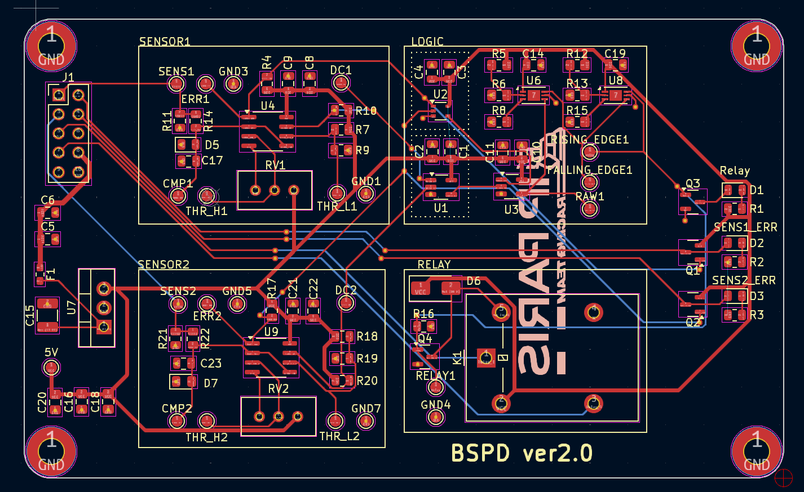

IP Paris Racing Team competes in Formula Student, an international engineering competition where student teams design, build and race a formula-style car. I'm on the Electronics team, working on the car's safety-critical low-voltage systems.

## My work

- Designed the Brake System Plausibility Device (BSPD): a non-programmable, system-critical circuit that cuts power when the brake and accelerator are pressed at the same time.
- Designed the "ready to drive" circuit, responsible for powering on the car.
- Verified both boards meet the competition's technical rules.

