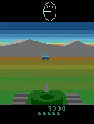
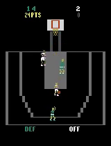
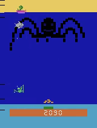
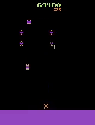
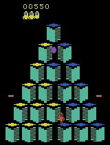

[CleanRL](https://github.com/vwxyzjn/cleanrl) provides single-file, research-friendly implementations of deep RL algorithms, but it has no QR-DQN. This project adds one, following the library's conventions of one self-contained file per algorithm variant.

QR-DQN [(Dabney et al.)](https://arxiv.org/abs/1710.10044) replaces DQN's single expected return with a fixed set of quantiles of the return distribution, trained with quantile regression.

Work was done as part of a semester project under the supervision of [Dr. Simo Alami](https://www.lix.polytechnique.fr/~alamichehboune/).

Wrote a [report](QRDQN_Report.pdf) and held a [defense](QRDQN_Presentation.pdf) of my work.



<!-- ![[Pong Distribution]](pong_distrib.png "Example of generated cumulative distribution functions.") -->

## Results

Evaluated my implementation on 5 games of the Atari 2600 benchmark. Matched the performance of the original paper on these games.

| Game | DQN | C51 | QR-DQN-0 | QR-DQN-1 | Ours |
|---|---|---|---|---|---|
| Battle Zone | 29,900 | 28,742 | 35,580 | 39,268 | **49,500** |
| Double Dunk | -6.6 | 2.5 | 12.3 | **21.9** | 18.8 |
| Name this Game | 8,207.8 | 12,542 | 17,557 | 21,890 | **23,013** |
| Phoenix | 8,485.2 | 17,490 | 65,767 | 16,585 | **124,298** |
| Q*Bert | 13,117.3 | 23,784 | 26,946 | **572,510** | 26,822 |

*Best agent performance: max of the average score over 10 games evaluated every 1M setps during training. Higher is better.*

Our results above were obtained with κ_huber = 1, same as QRDQN-1.





## Main files

The work lives on the `add-qrdqn` branch of my fork:

- `cleanrl/qrdqn.py`: classic control environments
- `cleanrl/qrdqn_atari.py`: Atari2600 environments, with a convolutional network